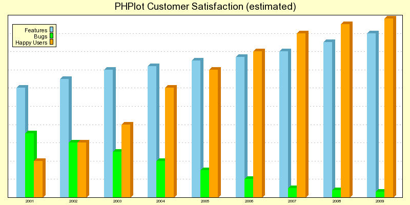

# PHPlot

## What is PHPlot?

PHPlot is a graph library for dynamic scientific, business, and stock-market charts and graphs. 
PHPlot allows PHP developers to create pie charts, bar graphs, line graphs, point graphs, etc. from a 
PHP application.

([view source](https://phplot.sourceforge.net/demosource.php))

## Where do I start?

The PHPlot project page on https://github.com/PHPlot/phplot is the place to go for downloads, help, and more.

## What about documentation?

A detailed [README](doc/README.md) is available in the 'doc' directory.

Changes are documented in [doc/NEWS.md](doc/NEWS.md).

See the directory `doc/manual/examples` for examples.

## Reference manual

The PHPlot Reference Manual contains everything you need to know about PHPlot, and more.

You can read the HTML version of the manual online here: [PHPlot Reference Manual (HTML)](https://phplot.sourceforge.net/phplotdocs/).

The PDF version of the manual is available here: [PHPlot Reference Manual (PDF)](https://phplot.sourceforge.net/phplotdocs/) (about 2.5 MB).

(**Note:** the Reference Manual might not be 100% up to date with the latest code releases.)

See [doc/manual/README.md](doc/manual/README.md) for how to build the manual locally (you will have to clone the source code 
from GitHub for that, as the manual sources are not included in the release tarballs or when installing via Composer).

## How much does it cost?

Trick question! It is completely free for you to use. You can also redistribute it unmodified without restriction. 

License: GNU Lesser General Public License, version 2.1. A copy of the license is included in [LICENSE](LICENSE)
